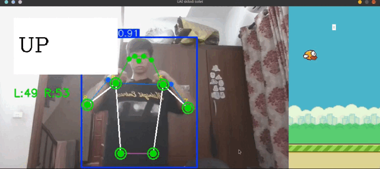

<div align="center">
    <h1>🎮 Flappy Bird – Pose Controlled (YOLOv8 + OpenCV + Pygame)</h1>
<hr/>
</div>

A Flappy Bird–style game controlled by **arm movements** using real-time human pose estimation with a **Custom Fine-Tuned YOLOv8 Pose model**.

This project focuses on **real-time computer vision**, human–computer interaction, and custom model training for stability.

## 🚀 Tech Stack
- **Game Engine**: Python & Pygame (for rendering the Flappy Bird game loop and UI)
- **Computer Vision**: OpenCV (`cv2`) (for webcam access, frame handling, and annotations)
- **Pose Estimation**: Ultralytics YOLOv8 (for real-time human pose detection)
- **Mathematical Processing**: NumPy (for angle calculation, interpolation, and smoothing arrays)

## 📁 Project Structure

```text
DolphinDive_Pose_Tracking/
├── main.py                # Entry point: Initializes Pygame window and launches the game
├── game.py                # Core game engine: Handles Pygame logic, YOLO inference, and UI
├── PoseDetector.py        # Wrapper class: Handles YOLOv8 model loading and angle mathematics
├── collect_data.py        # Utility script: Captures frames from webcam to build the custom dataset
├── auto_annotate.py       # Utility script: Uses YOLO to auto-generate COCO keypoint labels
├── requirements.txt       # List of Python dependencies (numpy, opencv-python, ultralytics, pygame)
├── yolov8n-pose.pt        # Default pretrained YOLOv8 Nano Pose weights (before fine-tuning)
├── assets/                # Contains all the images, audio, and fonts for the Flappy Bird game
├── flappy_pose_dataset/   # (Generated) Directory for your training images and auto-labels
└── runs/                  # (Generated) Directory where the fine-tuned custom weights are saved
```

## 1. Features

- **Custom Fine-Tuned Tracking**: Uses a YOLOv8-pose model specifically fine-tuned on custom game-play data for minimal jitter and high reliability.
- **EMA Smoothing**: Real-time Exponential Moving Average (EMA) mathematical smoothing to completely eliminate coordinate jittering during gameplay.
- **Performance Optimized**: Frame-skipping implemented to keep Pygame graphics blazing fast while running heavy pose inference in the background.
- Control the bird by **raising and lowering both arms**
- One unified window: Left (Camera view), Right (Game view)
- Classic Flappy Bird gameplay (pipes, gravity, score, sounds)



## 2. Custom Model Training Pipeline

If you want to re-train the model for your own room/lighting, follow this built-in pipeline:

### Step 1: Data Collection
Run the collection script to capture images of yourself playing:
```bash
python collect_data.py
```
*Press `r` to toggle auto-recording frames while you flap your arms.*

### Step 2: Auto-Annotation
Instead of manually drawing keypoints, use the pretrained model to auto-generate the YOLO COCO labels:
```bash
python auto_annotate.py
```
*This instantly generates `.txt` labels and `dataset.yaml`.*

### Step 3: Fine-Tuning
Train the model directly on your machine:
```bash
yolo pose train data=flappy_pose_dataset/dataset.yaml model=yolov8n-pose.pt epochs=50 imgsz=640 device=0 plots=True
```
*The `game.py` file is already configured to load the resulting `runs/pose/train/weights/best.pt` file!*

## 3. How the control works

The game tracks:
- Left arm angle: `(elbow – shoulder – hip)`
- Right arm angle: `(elbow – shoulder – hip)`

When **both arms move down** and the angles drop below a threshold, a **flap is triggered**.

Used keypoints (YOLOv8 format):
- Left side: 5, 7, 11
- Right side: 6, 8, 12

## 4. Technical Implementation & Mathematics

To make the game tracking robust, several mathematical techniques are applied directly to the raw YOLOv8 output:

### 4.1 Angle Calculation (Law of Cosines)
To determine if an arm is raised, the `PoseDetector` calculates the angle at the shoulder using the **Law of Cosines**.
Given 3 keypoints: **Elbow ($P_1$)**, **Shoulder ($P_2$)**, and **Hip ($P_3$)**:
1. Calculate the Euclidean distances between all three points ($a, b, c$).
2. Apply the formula to find the angle at the shoulder ($\theta$):
   $$\theta = \arccos\left(\frac{a^2 + c^2 - b^2}{2ac}\right)$$
   *(Converted from radians to degrees for easier thresholding)*

### 4.2 Linear Interpolation (Mapping)
Instead of dealing with raw degrees (which vary between people's flexibility), the game normalizes the angle using `numpy.interp()`:
- An angle of `30°` (arms down) maps to **0%**.
- An angle of `80°` (arms raised horizontally) maps to **100%**.
This percentage makes it extremely easy to trigger the flap boolean logic (`if perRight < 5 and perLeft < 5`).

### 4.3 Jitter Reduction (Exponential Moving Average)
Raw webcam coordinate inference jitters from frame to frame. A custom `PoseSmoother` class applies a discrete **Exponential Moving Average (EMA)** to the (x, y) coordinates of the arms before they are drawn or calculated:
$$S_t = \alpha \cdot X_t + (1 - \alpha) \cdot S_{t-1}$$
- Where $\alpha = 0.5$ (smoothing factor).
- This creates fluid motion on the screen without introducing noticeable input lag for the gamer.

## 5. Controls

| Action          | Method                                              |
|-----------------|-----------------------------------------------------|
| Flap            | Lower both arms                                     |
| Flap (fallback) | Press `SPACE`                                      |
| Quit            | Press `q` (camera window) or close the game window |

## 5. How to run

Requirements: Python 3.9+

5.1. Create virtual environment
```bash
python -m venv venv
source venv/bin/activate        # Linux / macOS
venv\Scripts\activate           # Windows
```

5.2 Install dependencies
```bash
pip install -r requirements.txt
```
5.3 Run the game
```bash
python main.py
```

## ⚠️ Important notes

- Only the **first detected person** is used.
- The model runs on GPU if available (use_gpu=True).
- If CUDA is not available, it will automatically fall back to CPU.
- Lighting and camera position strongly affect detection stability, which is why the fine-tuning tools are included!